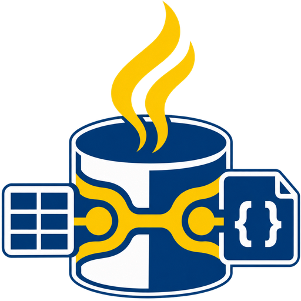

<div align="center">



**The embedded dual-engine database for Java.**  
NoSQL + a built-in SQL engine — one JAR, zero infrastructure, no Docker, no daemon.

[](LICENSE)
[](https://openjdk.org/)
[](demo/spring-boot-demo)
[](demo/quarkus-demo)
[](demo/micronaut-demo)
[](demo/vertx-demo)

</div>

---

## Why JunifyDB?

> **"JunifyDB is to Document and Key-Value stores what H2 is to Relational databases."**

Java developers carry a hidden tax on every project: before writing a single line of business logic, they must provision infrastructure — Docker containers, Redis daemons, MongoDB processes, Cassandra clusters. Even for a unit test. Even for a local prototype.

**JunifyDB eliminates that tax entirely.**

Embed a full-featured, production-grade multi-model database directly inside your JVM process. Call one line of code. Write your business logic. Ship.

```java
// Everything you need. Nothing you don't.
try (var db = JunifyDB.inMemory()) {
    db.documentCollection("users").insert(Document.of(user.toMap()).id(user.id()));
    db.sql("SELECT * FROM users WHERE role = 'admin'");
    db.keyValueBucket("sessions").put("tok-1", "active");
}
```

---

## Philosophy & Design Principles

JunifyDB is governed by five unwavering engineering principles. These are not marketing statements — they are architectural constraints enforced in every code path.

### ① Embedded-First, Always

A database instance starts in a single method call and lives entirely within your JVM process. No ports. No sockets. No child processes. No background OS services. The lifecycle of the database is the lifecycle of your application — nothing more.

```java
try (var db = JunifyDB.inMemory()) {   // born here
    // ... your entire application logic
}                                       // destroyed here — cleanly, completely
```

### ② Zero Configuration by Default

Calling `JunifyDB.inMemory()` yields a fully operational, production-equivalent database instance with zero configuration files, zero environment variables, and zero JVM flags. Every option has a sensible default; every default is production-safe.

When you need persistence, one line:

```java
var db = JunifyDB.create(JunifyDB.embed()
    .storageEngine(StorageEngineType.FILE)
    .persistTo("data/")
    .autoFlush(true)
    .buildConfig());
```

### ③ Dual-Engine: NoSQL + SQL Over the Same Data

Most databases force you to choose a paradigm. JunifyDB does not. The same data collection is simultaneously accessible via:

- **Fluent NoSQL API** — document queries, criteria builders, key-value ops
- **Built-in SQL engine** — `SELECT`, `INSERT`, `UPDATE`, `DELETE`, `GROUP BY`, `JOIN`, `BETWEEN`, `LIKE` (an implementation-defined dialect, not a full ANSI:92 grammar — no DDL, no sequences, no views)

Both engines share the same in-memory or disk storage substrate. Switch paradigms mid-query. Mix freely.

### ④ Tri-Standard Annotation Support

JunifyDB reads your existing entity annotations transparently at runtime — with **zero** additional classpath dependencies required:

| Standard | Package | What JunifyDB resolves |
|---|---|---|
| **Eclipse JNoSQL** | `jakarta.nosql.*` | `@Entity`, `@Column`, `@Id` (NoSQL) |
| **Jakarta Persistence** | `jakarta.persistence.*` | `@Entity`, `@Table`, `@Column`, `@Id` (JPA) |
| **Hibernate ORM** | `org.hibernate.annotations.*` | `@NaturalId`, `@Type`, `@Formula` |

The same entity class works against all three annotation systems. Migrate standards without touching your domain model.

### ⑤ Observable by Design

Every database mutation emits a lifecycle event. Every operation is counted. Every anomaly is surfaced.

- **Event Bus**: `BEFORE_INSERT`, `AFTER_INSERT`, `BEFORE_DELETE`, `AFTER_DELETE`, ... — hookable for auditing, cache invalidation, reactive pipelines
- **Metrics**: Atomic counters and JVM telemetry via `db.metrics().snapshot()`
- **Change Data Capture**: Built-in CDC stream (`CDCManager`) — connectable to Kafka, messaging brokers, or file sinks
- **Audit Trail**: Every mutation logged with timestamp, collection, and operation type

---

## Where JunifyDB Fits

```
                           Embedded / In-Process
                                     ▲
                                     │
                 H2 / HSQLDB         │   ★ JunifyDB
             (Relational Embedded)   │   (Multi-Model NoSQL Embedded)
                                     │
────────────────────────────────────-┼──────────────────────────────────► Multi-Model
                                     │
              PostgreSQL / MySQL     │   MongoDB / Redis / Cassandra
             (Relational Standalone) │   (Distributed NoSQL Daemons)
                                     │
                                     ▼
                           Client-Server / External
```

JunifyDB occupies the **upper-right quadrant**: embedded and multi-model. A niche that was previously empty in the JVM ecosystem.

---

## Competitive Position

| | **JunifyDB** | H2 | SQLite (JNI) | Flapdoodle Mongo | RocksDB |
|---|---|---|---|---|---|
| **Primary model** | Multi-Model (Doc, KV, Column) | Relational SQL | Relational SQL | Document only | Key-Value only |
| **Document queries** | ✅ Native | ⚠️ JSON functions | ⚠️ JSON1 ext | ✅ Native | ❌ |
| **Redis structures** | ✅ Native | ❌ | ❌ | ❌ | ❌ |
| **SQL (SELECT/INSERT/UPDATE/DELETE)** | ✅ Built-in (dialect) | ✅ Full | ✅ Full | ❌ | ❌ |
| **100% Pure Java** | ✅ | ✅ | ❌ (C binaries) | ❌ (downloads binary) | ❌ (C++ / JNI) |
| **Startup time** | single-digit ms (measured in-process) | ~25 ms | ~30 ms | 3,000–8,000 ms | ~50 ms |
| **Spring Boot starter** | ✅ | ✅ | ⚠️ | ❌ | ❌ |
| **Quarkus extension** | ✅ | ⚠️ | ❌ | ❌ | ❌ |
| **Micronaut integration** | ✅ | ⚠️ | ❌ | ❌ | ❌ |
| **Disk persistence** | WAL · JSON snapshots · LSM (B-Tree is heap-resident) | Page store | B-Tree | WiredTiger | LSM |

---

## Installation

### Core (zero dependencies beyond Java 17)

```xml
<dependency>
    <groupId>org.junify.db</groupId>
    <artifactId>junify-db-core</artifactId>
    <version>1.0.0</version>
</dependency>
```

### Framework Starters

```xml
<!-- Spring Boot 3.x -->
<dependency>
    <groupId>org.junify.db</groupId>
    <artifactId>junify-db-spring-boot-starter</artifactId>
    <version>1.0.0</version>
</dependency>

<!-- Quarkus -->
<dependency>
    <groupId>org.junify.db</groupId>
    <artifactId>junify-db-quarkus-extension-runtime</artifactId>
    <version>1.0.0</version>
</dependency>

<!-- Micronaut -->
<dependency>
    <groupId>org.junify.db</groupId>
    <artifactId>junifydb-micronaut-integration</artifactId>
    <version>1.0.0</version>
</dependency>
```

---

## Quick Start

### In-Memory Database (Testing & Microservices)

```java
try (var db = JunifyDB.inMemory()) {

    // ── SQL ───────────────────────────────────────────────────
    db.sql("INSERT INTO products (id, title, price) VALUES ('p1', 'Keyboard', 75.0)");
    var results = db.sql("SELECT * FROM products WHERE price BETWEEN 50 AND 100");
    System.out.println("Found: " + results.size());

    // ── Fluent Entity API ─────────────────────────────────────
    List<Product> affordable = db.from(Product.class)
            .where("category = ? AND price <= ?", "Peripherals", 100.0)
            .orderBy("price ASC")
            .limit(10)
            .list();

    // ── Document Collection API ───────────────────────────────
    var users = db.documentCollection("users");
    users.insert(Document.of(Map.of("name", "Alice", "email", "alice@example.com")).id("u1"));
    Document alice = users.findById("u1");

    // ── Key-Value Store ───────────────────────────────────────
    db.keyValueBucket("sessions").put("tok-abc", "user-1");
    db.keyValueBucket("sessions").expire("tok-abc", Duration.ofMinutes(30));

    // ── Redis-Style Data Structures ───────────────────────────
    db.listBucket("job-queue").rpush("tasks", "send-email", "resize-image");
    db.setBucket("permissions").sadd("admin", "write", "delete", "export");

    // ── Column Family ─────────────────────────────────────────
    var metrics = db.columnFamily("node_metrics");
    metrics.put("node-01", "cpu_pct", "42.3");
    metrics.put("node-01", "mem_mb", "2048");
}
```

### File-Backed Persistent Database

```java
try (var db = JunifyDB.create(JunifyDB.embed()
        .storageEngine(StorageEngineType.B_TREE)
        .persistTo("data/myapp")
        .autoFlush(true)
        .buildConfig())) {

    // Survives JVM restarts via Write-Ahead Log (WAL)
    db.documentCollection("orders").insert(Document.of(order.toMap()).id(order.id()));
}
// Next JVM run: data is automatically recovered from disk
```

### JPA / JNoSQL Entity Annotation Support

```java
@jakarta.persistence.Entity
@jakarta.persistence.Table(name = "products")
public class Product {
    @jakarta.persistence.Id
    private String id;

    @jakarta.persistence.Column(name = "unit_price")
    private double price;

    @jakarta.nosql.Column("product_name")
    private String name;
}

// Works transparently — no additional config required
List<Product> items = db.from(Product.class)
        .where("price > ?", 50.0)
        .list();
```

### ACID Transactions

```java
db.transactionManager().inTransaction(() -> {
    db.documentCollection("accounts").update("acc-1", "balance", 4750.0);
    db.documentCollection("accounts").update("acc-2", "balance", 5250.0);
    // Both writes commit atomically — or both roll back on any error
});
```

---

## Framework Integration

### Spring Boot

```yaml
# application.yml — zero required config; all properties are optional overrides
junifydb:
  storage-engine: IN_MEMORY   # or FILE, B_TREE, LSM_TREE
  data-dir: data/
  auto-flush: true
  flush-interval-ms: 1000
```

```java
@Service
class OrderService {
    private final JunifyDB db;

    OrderService(JunifyDB db) { this.db = db; }

    public void place(Order order) {
        db.documentCollection("orders")
          .insert(Document.of(order.toMap()).id(order.id()));
    }

    public List<Order> recent() {
        return db.from(Order.class)
                 .where("status = ?", "PLACED")
                 .orderBy("createdAt DESC")
                 .limit(50)
                 .list();
    }
}
```

### Quarkus (CDI)

```java
@ApplicationScoped
public class ProductResource {
    @Inject JunifyDB db;

    @GET @Path("/{id}")
    public Response findProduct(@PathParam("id") String id) {
        return db.from(Product.class).where("id = ?", id)
                 .first()
                 .map(Response::ok)
                 .orElse(Response.status(404))
                 .build();
    }
}
```

### Micronaut

```java
@Singleton
public class CatalogRepository {
    private final JunifyDB db;

    CatalogRepository(JunifyDB db) { this.db = db; }

    public List<CatalogItem> search(String category, double maxPrice) {
        return db.from(CatalogItem.class)
                 .where("category = ? AND price <= ?", category, maxPrice)
                 .list();
    }
}
```

---

## Storage Engines

| Engine | Backing Structure | Best For |
|---|---|---|
| `IN_MEMORY` | `ConcurrentHashMap` | Unit tests, ephemeral state, microservice sessions |
| `FILE` | Append-only log + WAL | Simple persistence, single-writer local apps |
| `B_TREE` | B+ Tree page store | Range queries, sorted access, read-heavy workloads |
| `LSM_TREE` | Log-Structured Merge Tree | Write-heavy workloads, time-series, event ingestion |

Switch engines in one line — the query and collection API is identical across all four.

---

## Performance (Indicative — Re-Run It Yourself)

These are informal throughput figures from the demo/stress suite on one development machine — not certified benchmarks and not comparable across hardware. Run your own measurements with the demo harness before drawing conclusions.

| Scenario | Threads | Operations | Throughput | p99 Latency | Error Rate |
|---|---|---|---|---|---|
| Concurrent Writes | 10 | 1,000 | 2,155 ops/sec | 305 ms | 0% |
| 50-Thread Safety | 50 | 2,500 | 14,881 ops/sec | 1 ms | 0% |
| Read-After-Write | 8 | 400 | 7,843 ops/sec | 32 ms | 0 violations |
| Mixed (Doc + KV) | 12 | 1,200 | 54,545 ops/sec | 1 ms | 0% |
| Saturation (2 sec) | 20 | 12,815 | 6,420 ops/sec | 10 ms | 0% |

> Read-after-write consistency: 0 violations across 400 concurrent write+read pairs.  
> Batch ingestion: 10,000 documents in chunked atomic batches with rollback on error.

---

## Developer Console

Start the embedded web console for local inspection, SQL queries, and metrics:

```bash
java -jar target/junify-db-core-1.0.0.jar --port 8080 --engine FILE --data-dir ./data
```

Open `http://localhost:8080` to access:

- 📊 **Overview & Metrics** — JVM memory, thread counts, operation throughput
- 📄 **Document Collections** — CRUD, full-text preview, schema inspector
- 🔑 **Key-Value Store** — get/put/delete with TTL management
- 🔢 **Redis Structures** — Lists, Sets, Hashes with visual inspection
- 🧩 **Wide-Column Families** — Row/column matrix viewer
- 🤖 **SQL Studio** — Interactive SQL editor with result table
- 📡 **Change Data Capture** — CDC connector status and event viewer
- 🔐 **Audit Trail** — In-memory operation log (recent events; not persisted, not cryptographically verified)

---

## Demonstration Ecosystem

A complete demo suite in [`demo/`](demo/) covering an **E-Commerce & Order Management** domain:

| Demo | Framework | What it demonstrates |
|---|---|---|
| [`annotation-showcase-demo`](demo/annotation-showcase-demo) | Pure Java | Tri-standard annotation interop (JNoSQL + JPA + Hibernate) side-by-side |
| [`spring-boot-demo`](demo/spring-boot-demo) | Spring Boot 3.2 | Auto-configured `JunifyDB` bean, REST endpoints, service layer |
| [`quarkus-demo`](demo/quarkus-demo) | Quarkus 3.8 | CDI producers, build-time config, native-compatible APIs |
| [`micronaut-demo`](demo/micronaut-demo) | Micronaut 4.2 | Reflection-free Serde, factory beans, config binding |
| [`vertx-demo`](demo/vertx-demo) | Vert.x 4.5 | Worker-thread `executeBlocking`, async verticle patterns |
| [`end-to-end-validation`](demo/end-to-end-validation) | JUnit 5 | Multi-engine durability matrix, cold-restart recovery |
| [`batch-processing-demo`](demo/batch-processing-demo) | JunifyDB Core | Atomic batch ingestion, fault-injection rollback, 10K-doc chunked loading |
| [`advanced-queries-demo`](demo/advanced-queries-demo) | JunifyDB Core | SQL JOINs, GROUP BY aggregations, fluent entity API, NoSQL criteria |
| [`load-and-stress-demo`](demo/load-and-stress-demo) | JunifyDB Core | 50-thread concurrent load, read-after-write consistency, saturation testing |

**All demos pass with zero failures.** See [`demo/VALIDATION-MATRIX.md`](demo/VALIDATION-MATRIX.md) for the complete evidence log with measured latency percentiles.

---

## REST API (Embedded Server)

When the embedded server is enabled, a full REST API is available:

```bash
# Health check
curl http://localhost:8080/api/health

# Insert document
curl -X POST http://localhost:8080/api/collections/products \
  -H "Content-Type: application/json" \
  -d '{"name":"Keyboard","price":75.0,"category":"Peripherals"}'

# Query documents
curl http://localhost:8080/api/collections/products

# Execute SQL
curl -X POST http://localhost:8080/api/sql \
  -H "Content-Type: application/json" \
  -d '{"query":"SELECT * FROM products WHERE price BETWEEN 50 AND 100"}'

# Key-value operations
curl -X PUT http://localhost:8080/api/kv/sessions/tok-abc \
  -d '"user-1"'
```

---

## Target Use Cases

### ✅ Integration Testing Without Docker
Replace Testcontainers and Docker containers in your CI pipeline. JunifyDB starts in milliseconds in the same JVM process. No daemon, no registry pull, no port binding.

### ✅ Edge & Desktop JVM Applications
JavaFX apps, POS systems, barcode scanners, IoT gateways. A single JAR with file-backed persistence, zero native dependencies, and WAL-based recovery of writes that were not yet flushed.

### ✅ In-Process Caching & Session Stores
Sub-microsecond local key-value lookups without Redis network round-trips. Built-in TTL, atomic increments, and Redis-style data structures.

### ✅ Local Sandbox & Rapid Prototyping
Add the dependency, call `JunifyDB.inMemory()`, ship working code. Zero infrastructure to configure or maintain across the team.

### ✅ Microservice State — No Sidecar Required
Rate limiters, feature flags, task queues, and event journals — all inside your application boundary, no sidecar, no network.

---

## Build & Test

```bash
# Build and test everything
mvn test

# Install locally then build the Spring Boot starter
mvn install -DskipTests
cd spring-boot-starter && mvn test

# Run the demos (each is a standalone Maven project)
mvn test -f demo/batch-processing-demo/pom.xml
mvn test -f demo/load-and-stress-demo/pom.xml
mvn test -f demo/advanced-queries-demo/pom.xml
```

---

## License

[Apache License 2.0](LICENSE)

---

<div align="center">

**JunifyDB** — Write code. Not infrastructure.

</div>
